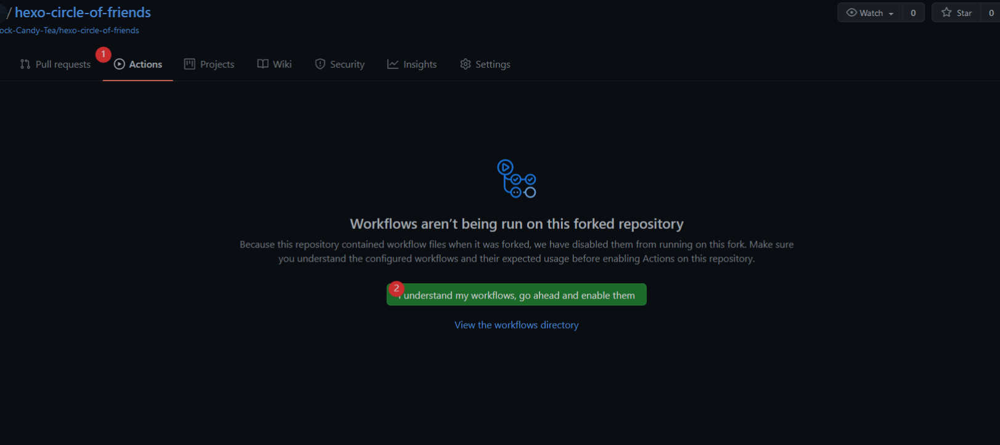
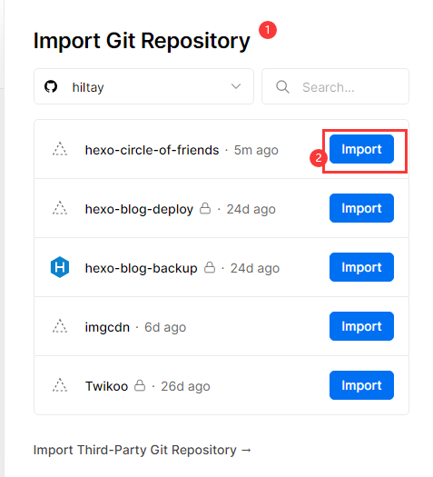
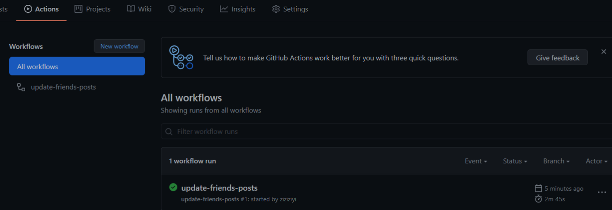

# 后端部署

其中github为云端部署，server和docker需要您自备服务器。

## github部署

这是默认的部署方式，即：github+leancloud+vercel

整个部署均在云端完成。运行原理：

1. 通过github action启动爬虫抓取友链文章数据
2. 数据由爬虫推送至数据库保存（默认为leancloud，可以自行更改）
3. vercel部署的api从数据库获取数据交付给前端

部署方法：

fork友链朋友圈的项目仓库，地址：https://github.com/Rock-Candy-Tea/hexo-circle-of-friends

在`fork`后仓库中，编辑仓库中的`/hexo_circle_of_friends/setting.py`文件，必须修改的配置如下：

```python
FRIENDPAGE_STRATEGY={
    "strategy": "default",
    "theme": "butterfly"  # 请修改为您的主题
}
```

然后点击仓库的`Settings-->Secrets-->New repository secret`


添加环境变量，secert中必须添加你的友链链接地址`LINK`，以及：

- 如果数据库选择的是leancloud，请添加`APPID`和`APPKEY`
- 如果数据库选择的是mysql，请添加登录用户名`MYSQL_USERNAME`，登录密码`MYSQL_PASSWORD`，数据库IP地址`MYSQL_IP`，要连接到的库的名称`MYSQL_DB`
- 如果数据库选择的是sqlite，请添加`GH_NAME`，`GH_EMAIL`，`GH_TOKEN`，可以参考[配置示例](settings.md?id=githubsqlite)。

下面演示使用leancloud的存储方式，首先需要创建leancloud数据库，创建方式见[这里](problems.md?id=如何创建leancloud数据库？)。

如下图所示，在仓库分别添加`APPID`和`APPKEY`，获取方式见[这里](problems.md?id=如何获取appid和appkey？)。


启用`fork`后仓库的github action，点击`Actions-->I understand my workflows, go ahead and enable them`



之后点击`update-friends-posts`并启用`workflow`


前往[vercel官网](https://vercel.com/)，直接用github创建账号并用手机号绑定。

点击`New Project`新建项目

找到`Import Git Repository`，应该可以看见你刚刚`fork`的仓库，点击`Import`。



添加环境变量，其中：

- 如果数据库使用leancloud，请添加`APPID`和`APPKEY`
- 如果数据库使用mysql，请添加登录用户名`MYSQL_USERNAME`，登录密码`MYSQL_PASSWORD`，数据库IP地址`MYSQL_IP`，要连接到的库的名称`MYSQL_DB`
- 如果数据库使用sqlite，不需要配置

添加完成后，点击`Deploy`。


回到首页，等待一会，应该会部署完成。

之后回到点击仓库`star`来完成第一次程序运行，不出意外的话结果如下图：



（这时刚刚的leancloud上也能看到上传的数据。）此后在每天的0,6,12,18,21点整，都会自动启动爬虫进行爬取。

在vercel找到`DOMAINS`下面的地址，如：https://hexo-friendcircle4-api.vercel.app ，前端需要的就是这个地址。


在这个地址后面拼接`/all`尝试访问，出现数据就说明配置成功。

如果想使用其他数据库，请参考[配置项说明](settings.md)。

## server部署

首先请确保你的服务器安装好python3.8环境和git，如果未安装可参考[如何安装python环境](problems.md?id=如何安装python环境？)和[如何安装git](problems.md?id=如何安装git？)

运行原理：

1. 启动爬虫抓取友链文章数据
2. 数据由爬虫推送至数据库保存（默认为leancloud，可以自行更改）
3. vercel（或者服务器）部署的api从数据库获取数据交付给前端

部署方法：

`clone`项目仓库，地址：https://github.com/Rock-Candy-Tea/hexo-circle-of-friends

编辑`/hexo_circle_of_friends/setting.py`文件，必须修改的配置如下：

```python
FRIENDPAGE_STRATEGY={
    "strategy": "default",
    "theme": "butterfly"  # 请修改为您的主题
}

DEPLOY_TYPE = "server"
```

然后编辑`server.sh`文件，将`LINK`修改为你的友链链接地址，将`EXPOSE_PORT`修改为你想要对外暴露的端口号，以及：

- 如果数据库选择的是leancloud，请添加`APPID`和`APPKEY`
- 如果数据库选择的是mysql，请添加登录用户名`MYSQL_USERNAME`，登录密码`MYSQL_PASSWORD`，数据库IP地址`MYSQL_IP`，要连接到的库的名称`MYSQL_DB`
- 如果数据库选择的是sqlite，不需要配置

如需更换数据库，以及其它更多配置，详见[配置项说明](settings.md)。

修改完成后，依次执行：

添加脚本执行权限，运行脚本

```bash
cd hexo-circle-of-friends/
chmod a+x server.sh
./server.sh
```

部署完毕，服务器上开始运行两个进程，一个是爬虫程序，另一个是api服务。

尝试访问API：

```bash
curl 127.0.0.1:8000/all
```

出现数据即为部署成功。

接下来，开放服务器的对应端口（我这里是8000），就可以通过`IP:端口`或者`域名:端口`访问到API，前端需要的就是这个地址。

也可以通过配置反向代理，转发到网站的80端口下。

## docker部署

首先请确保你的服务器安装好docker和git，如果未安装可参考[如何安装docker](problems.md?id=如何安装docker？)和[如何安装git](problems.md?id=如何安装git？)

运行原理：

1. 通过Dockerfile构建自定义镜像
2. 启动容器，容器内爬虫抓取友链文章数据
3. 数据由爬虫推送至数据库保存（默认为leancloud，可以自行更改）
4. api从数据库获取数据交付给前端

部署方法：

`clone`项目仓库，地址：https://github.com/Rock-Candy-Tea/hexo-circle-of-friends

编辑`/hexo_circle_of_friends/setting.py`文件，必须修改的配置如下：

```python
FRIENDPAGE_STRATEGY={
    "strategy": "default",
    "theme": "butterfly"  # 请修改为您的主题
}

DEPLOY_TYPE = "docker"
```

然后编辑`/Dockerfile`文件，将`LINK`修改为你的友链链接地址，以及：

- 如果数据库选择的是leancloud，请添加`APPID`和`APPKEY`
- 如果数据库选择的是mysql，请添加登录用户名`MYSQL_USERNAME`，登录密码`MYSQL_PASSWORD`，数据库IP地址`MYSQL_IP`，要连接到的库的名称`MYSQL_DB`
- 如果数据库选择的是sqlite，不需要配置

如需更换数据库，以及其它更多配置，详见[配置项说明](settings.md)。

修改完成后，依次执行：

构建镜像

```bash
cd hexo-circle-of-friends/
docker build -t fcircle .
```

等待构建完成后，创建容器：

```bash
docker run -di -p [port]:8000 -v /tmp/:/tmp/ fcircle
# 其中 [port] 替换为你需要开放的端口，比如：
docker run -di -p 8000:8000 -v /tmp/:/tmp/ fcircle
```

输入`docker ps`查看创建情况：


尝试访问API：

```bash
curl 127.0.0.1:8000/all
```

出现数据即为部署成功。

接下来，开放服务器的对应端口（我这里是8000），就可以通过`IP:端口`或者`域名:端口`访问到API，前端需要的就是这个地址。

也可以通过配置反向代理，转发到网站的80端口下。

